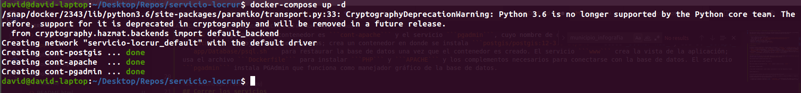

# Servicio de Información y Conocimiento de Localidades Rurales (SICLR)

Esta aplicación ofrece un servicio de consulta y descarga de datos de vulnerabilidad poblacional y de información de localidades. Tiene dos aproximaciones, descarga de datos de localidades rurales y descarga de datos de territorios.

Es una aplicación que está hecha en PHP y JavaScript, el servidor se ejecuta con APACHE y el modelo es una base de datos de PostgreSQL con extension PostGIS para las relaciones geoespaciales.

## Cómo contribuir a este repositorio

- Clona el repositorio en tu máquina:
  - Para la opción con https ```git clone https://github.com/macer-tech/servicio-locrur.git```
  - Para la opción con ssh ```git clone git@github.com:macer-tech/servicio-locrur.git```
- Crea una rama: ```git checkout -b <branch name>```
- Consigna tus cambios en la rama creada.
- Realiza un _push_ de tu rama hacia el repositorio.
- Solicita un _Pull Request_ hacia la rama ```develop```.

# Cómo ejecutar el SICLR

## Descripción

El SICLR se ejecuta usando Docker y Docker compose. Los archivos ```Dockerfile``` y ```docker-compose.yml``` se encuentran en la raíz del repositorio. El archivo ```docker-compose.yml``` crea tres servicios: el servicio ```database``` cuyo nombre de contenedor es ```cont-postgis```, el servicio ```www```, cuyo nombre de contenedor es ```cont-apache``` y el servicio ```pgadmin```, cuyo nombre de contenedor es ```cont-pgadmin```. El servicio ```database``` aloja  la base de datos; crea un contenedor en donde se instala ```postgis/postgis:12-3.3-alpine``` desde _Docker Hub_ y usa el _script_ ```app/Database/psql.sh``` para restaurar la base de datos una vez que el contenedor es creado. El servicio ```www``` crea la vista de la aplicación; usa el archivo ```Dockerfile``` para instalar ```PHP``` y ```APACHE``` y los complementos necesarios para conectarse con la base de datos. El servicio ```pgadmin``` instala PGAdmin que funciona como manejador gráfico de la base de datos.

## Correr los servicios

Para poder poner en línea los servicios debes asegurarte de tener instalado Docker ([Get Docker](https://docs.docker.com/get-docker/)) y Docker compose ([install docker compose](https://docs.docker.com/compose/install/linux/)).

Para instalar Docker en Ubuntu 20.04 (Focal Fosa):

```
sudo apt update && sudo apt install --yes docker.io
```

Para correr Docker sin necesidad de usar ```sudo``` agrega tu usuario al grupo ```docker```:

```
sudo usermod -aG docker $USER
```

Ya que tienes instalado Docker y Docker compose, posiciónate en la raíz del repositorio y ejecuta:

```
docker-compose up -d
```

Si la instrucción es exitosa, se deben crear los tres servicios descritos arriba. La restauración de la base de datos dentro del servicio ```database``` lleva un poco menos de un minuto.

{width=100%}

Puedes ver el servicio usando el puerto 8000:

Para la opción de búsqueda por localidades:

```
localhost:8000/select.php
```

Para la opción de búsqueda por localidades:

```
localhost:8000/servicio-map.php
```

Para el servicio ```pgadmin```:

```
localhost:8080
```
